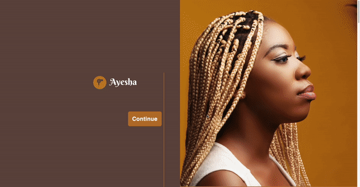

# Ayesha
Ayesha is  a website that features a salon. Users can look at the salon services as well as learn more about the stylists.

Link to Project: https://ayeshasalonco.netlify.app/

# How It's Made:
<strong>Tech used:</strong> HTML, CSS, Javascript

I first focused on the structure of the site. I decided how I wanted to organize each section. I created sectioned each part of the website and labeled each. Using HTML, I input the logo for the site and the photo. The button leads to the about us section when clicked. I changed the button color and rounded the corners of it using CSS. I also added the images for each. I also created a list of services for the salon. I organized each type of service into sections and set the border's color and weight. For each stylist, I included their name and bio on the left. I added their picture on the right. For the salon hours, I created a table.
# Lessons Learned
Creating the service menu for the site was hard for me. It was hard for me to find the right way to organize it. I first created tables for each category of services. I wasn't satisfied with the result. The prices didn't align properly. I tried to find a way to fix it, but I couldn't figure it out. So, I decided to try a different method. I separated each service type into sections using div tags. The result looked clean and organized. I learned to move on from ideas that aren't working. It can prevent you from getting the best result.
